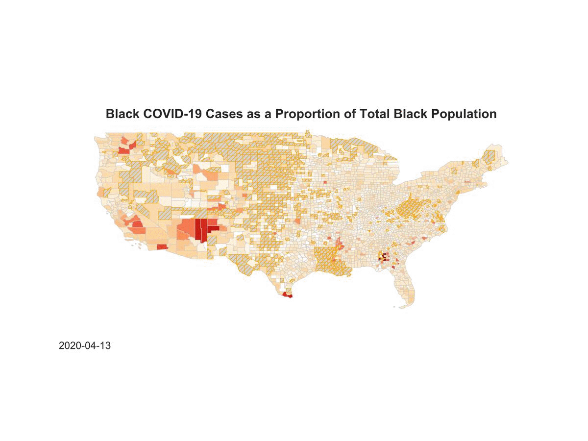

# ML-for-PP: Disparate Impacts of Covid-19

Richard Chang, John Greer, Nicholas Pierson , Nicolás Torres-Echeverry

This repository has the content of a project for the course CAPP 30254 1 Machine Learning for Public Policy, taught at the University of Chicago during the eccentric Spring of 2020.

The Project aims to predict the Covid19 infection rates for African American as a percentage of the AA population at the county level during the second half of April 2020. It employs a supervised machine learning algorithm that trains and tests the data doing a grid search over and using as input a Florida dataset. It finds that a Random Forest Regressor model provides the best predictions and deploys this model over the data for all US Counties.

The repository has four notebook:

- 0.Data_Builder.ipynb
- 1.Model_Training_Testing_Deploying.ipynb
- 2.Visualizations.ipybn (**The .shp file in /geo has to be unzipped before running it**)
- 3.Model_Variations.ipynb

It also contains seven csv files from which we extracted our features and target:

- All counties cardio.csv
- CountyHealth.csv
- counties.csv
- final_fl_df.csv
- fl_mobility_and_cases.csv
- interventions.csv
- us-counties.csv

The final_all_counties_df.csv file is the one our 0.Data_Builder notebook creates from the various sources. 

Finally, figures and tables for the analysis are inside the following folders:

- Figures
- Tables

The folder geo contains the geodata to create the maps. **The .shp file in /geo has to be unzipped before running notebook 2.Visualizations.** 

### The map below is a visualization of the predictions we are getting for our period of interest.

